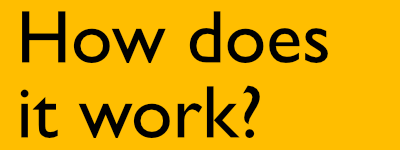
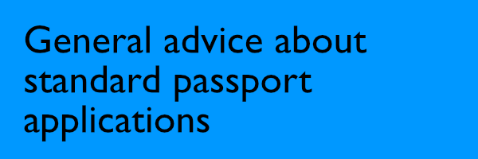

# The FAQ of [@ukpassportcheck](https://twitter.com/ukpassportcheck).

<blockquote>Here are the most commonly asked questions I get on Twitter, and the answers to them.
</blockquote>

<blockquote><b>WARNING</b>: Before booking anything please make sure you have read through <a href="https://www.gov.uk/get-a-passport-urgently">
The UK Government Official website on getting an urgent passport.</a>
</blockquote>

-----

  

  

How does this work Twitter Bot/Account?

 
<blockquote>
The bot checks the Premium and Fast Track websites every minute. If the websites 
have a status change (online to offline, or offline to online) the bot will post a tweet.
The bot then posts the appointments table it sees. The bot keeps checking, and if more
appointments are added it will post again to Twitter.
  

  

  
</blockquote>

How do I get notifications of tweets?

 
<blockquote>
You can click the bell symbol (🔔) on the profile if you're using the Twitter mobile
app, this will then send you a push notification when the account tweets.
  
</blockquote>

  

  

I have a standard application being processed, can I book a online fast track 
or premium?

 
<blockquote>
You cannot have more than one application in progress. You would need to contact
the <a href="https://www.gov.uk/passport-advice-line">passport advice line</a>
and withdraw your original application to use the Fast Track or Premium service. This
can take up to 3 weeks to complete.
</blockquote>
  

Can you book for me?

 
<blockquote>
No, I do not book for other people.
</blockquote>
  

  

The bot hasn't posted in a while, is it still working?

 
<blockquote>
Unless I've changed the code on the main, working code (which I don't unless there is
a big update, then it should be working all the time. To verify, check the account
bio, is the updated time up-to-date? If so, then the code is still working. If not, DM
me.
  
</blockquote>

Are you allowed to scrape information from a GOV.UK site?

 
<blockquote>
Yes, as long as you abide by their <a href="https://www.gov.uk/help/reuse-govuk-content">terms and conditions for web scraping</a>.
</blockquote>
  

  

-----

  

How can I pay you back for this service?

 
<blockquote>
Many people ask about how to thank me; I reply charity donations if possible. 
Many have donated to the Trussell Trust on my request but there is also a charity 
close to mine and my families heart too. Almost six years ago my nephew was born 
via emergency c section, he battled hard, but sadly passed away a week later. 
His name was Zachary 💙 and our family often raise money for The Grand Appeal  in his 
memory. I’ve set up a pot here:
  
<a href="https://www.justgiving.com/fundraising/donationsforzahary">
Just Giving Page</a>
  
It’s not my intentions for people to feel they have to donate to that page, 
Trussell Trust, or anywhere. You’re all travelling far and wide to get your 
passports and spending £££ doing so. I’m sharing this for those who are able to.
  
Thank you,
  
Michael ❤️
</blockquote>
  

  

-----

  

What's the difference between Fast Track and Premium?

 
<blockquote>
<a href="https://www.gov.uk/get-a-passport-urgently">
The UK Government Official website on getting an urgent passport explains the difference.</a>
But below is a small infographic which may also help.
  

  

</blockquote>
  

When do services go online?

 
<blockquote>
There is no set time. Typically, they go online every day of the week.
  
Lately (as of 04/08/2022), the patterns seem to be: 
1. Fast Track going online at around 09:00 
2. Premium going online at 10:00 
</blockquote>
  

I heard that they go online at midnight, is this true?

 
<blockquote>
Since the start of May this bot hasn't yet seen any evidence
that the services go online at midnight, or any set time. See above.
</blockquote>
  

Will there be appointments today?

 
<blockquote>
I'm afraid I don't have any knowledge of when they will go online next.
I produce a weekly newsletter, every Sunday, that will contain the statistics
from the previous week: <a href="https://www.getrevue.co/profile/ukpassportcheck">here</a>
</blockquote>
  

Will there be appointments for X office?

 
<blockquote>
I'm afraid I don't have any knowledge of what offices the appointments will go online for.
I produce a weekly newsletter, every Sunday, that will contain the statistics
from the previous week: <a href="https://www.getrevue.co/profile/ukpassportcheck">here</a>
</blockquote>
  

  

  

Your tweet says the service is online, but I keep getting System Busy, what 
do I do?

 
<blockquote>
That means the service is online but many people are trying to access it.
Keep refreshing, and you should hopefully get through and be able to book
an appointment.
</blockquote>
  

Your tweet says the service is online, but I keep getting a 503 error, what 
do I do?

 
<blockquote>
This means the server is down. Please wait.
</blockquote>
  

I need more than one appointment, can I book more than one at the same time?

 
<blockquote>
You can book more than one online in the same session, but you need to book two separate slots, one for each person you are applying for.
</blockquote>
  

I’ve not received a confirmation email of my booking, what do I do?

 
<blockquote>
If you have screenshot proof of your appointment on the confirmation page, and/or
confirmation of payment, then you should be ok. But contact the 
<a href="https://www.gov.uk/passport-advice-line">passport advice line</a>
to be sure. 
  
HMPO are starting to email people in this position now with the following:
  
<blockquote>
Dear Customer. 

Our records show that you made a payment for the 1-week Fast Track or Online
Premium passport service. However, due to a delay in completing the transaction,
you will not have received confirmation of the booking, and we do not have
a record of your chosen slot on our systems.

<b>What should you do</b>

Your booking will be honoured, however you will be asked on your arrival at
the appointment to provide proof of payment, and a copy of this email,
as evidence of your booking. Your appointment may be postponed if this evidence
is not provided when requested.

We're sorry for any inconvenience this may cause.

HM Passport Office
</blockquote></blockquote>
  

Can I change the date of my Fast Track appointment?

 
<blockquote>
Yes, as long as you're not within 48 hours of the appointment. You can
change the appointment date by clicking the link in your confirmation email
when the Fast Track service is next online. Then you will be able to select
a different date.
</blockquote>
  

Can I transfer my appointment to someone else?

 
<blockquote>
I don't think this is possible. Some people have had success doing this, but it is
not clear it can be done.
</blockquote>
  

How do I cancel my appointment?

 
<blockquote>
You will need to contact the 
<a href="https://www.gov.uk/passport-advice-line">passport advice line</a> 
and let them know why you need to cancel.
</blockquote>
  

  

  

I have a lost or damaged passport, can I used the Premium Service?

 
<blockquote>
You cannot use the service for a lost or damaged passport. HM Passport Office classes your passport as damaged if: 
	•	you can’t read any of your details 
	•	the laminate cover has come away 
	•	there’s an ink or chemical spillage on any of the pages 
	•	there’s discolouring of your personal details (for example your name or date of birth) or on the official observations page 
	•	any of the pages are ripped, missing or detached 
	•	the chip is damaged or showing through the back cover (e-passports only) 
	•	there’s any damage to the back cover (for example ripped, bite marks or staple holes) 
	•	there’s excess water damage
  
If any of these are true, then you will need to use the Fast Track service.
</blockquote>
  

Can I use this for a first time Adult or Child renewal passport?

 
<blockquote>
No. You can use the Fast Track Service though.
</blockquote>
  

My old passport was a Childs one, now I am an Adult and need a renewal. Can I use Premium for this?

 
<blockquote>
Yes. You can if you're now 16 or older.
</blockquote>
  

Does the Premium service reserve my appointment selection?

 
<blockquote>
Yes, it appears as though when you click an appointment time and date this is reserved
for you once you confirm your selection. You then have X minutes to complete your 
application (photo upload, application details and pay). The slot will be made open 
to booking for someone else if you do not finish in time. Therefore, please have your
photo and payment details ready at hand.</blockquote>
  

Can I change the date of my Premium appointment?

 
<blockquote>
Unfortunately, you cannot.
</blockquote>
  

  

-----

  

I have a standard application in progress but haven’t received it yet, 
what can I do?

 
<blockquote>
If you are within two weeks of travel, contact the 
<a href="https://www.gov.uk/passport-advice-line">passport advice line</a> and
they may be able to offer you a Fast Track upgrade. Otherwise, you can write and
request to withdraw your standard application in order to book an online urgent
appointment. However, it can take up to 3 weeks for your original application
to be cancelled.
</blockquote>
  

I’ve contacted the upgrades team, but they haven’t got back to me, 
what do I do?

 
<blockquote>
Unfortunately, I am unable to help. You will have to keep trying to get hold of them.
</blockquote>
  

